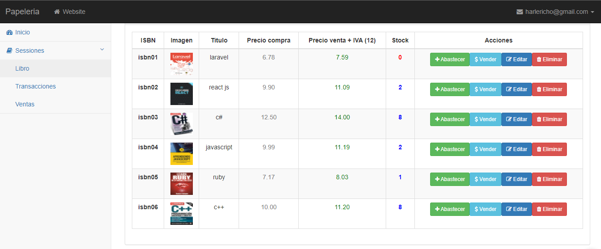

# Project made in PHP - MYSQL on a book sale module.

Computer Version:

> <strong> A program that allows you to manage the inventory of a small stationery store. </strong>

## 💻 Pre requirements

To use the project on your machine, you must have the following installed:

* Have a local server installed (Xampp, Lamp, Laragon, among others).
* Check if the installer server has PHP higher than 7.4 and MYSQL higher than 5.7.  

## 📫 Start project <project_papeleria>

To start the project <project_papeleria>, you must follow the following steps:
1. import the database script to your mysql manager
2. place the project inside the root of the local server (Xampp, Lamp, Laragon, among others)

## 🚀 Start the live service of php: 

There is another method to execute the project
* In the root of the project open a terminal and execute the command: php -S  127.0.0.1:7000
    > [http:/127.0.0.1:7000](http://127.0.0.1:7000)

### My social accounts

<strong>Copyright © 2022 Harlericho</strong>
